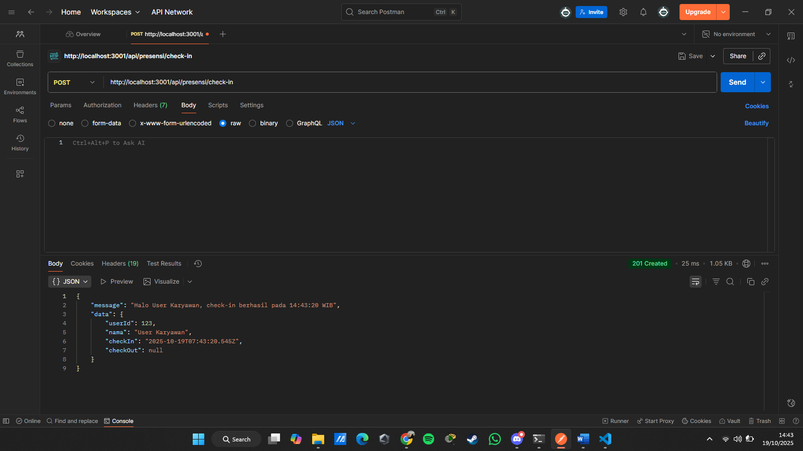
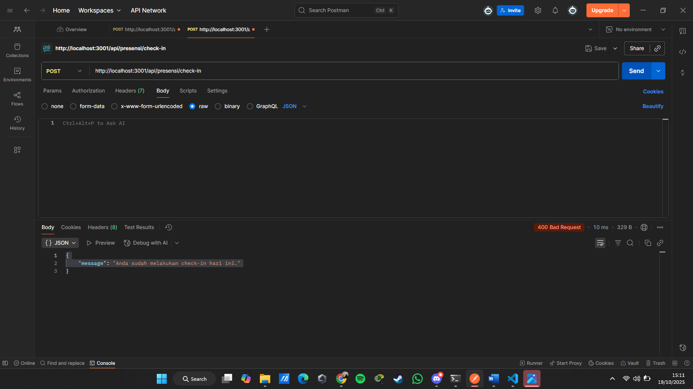
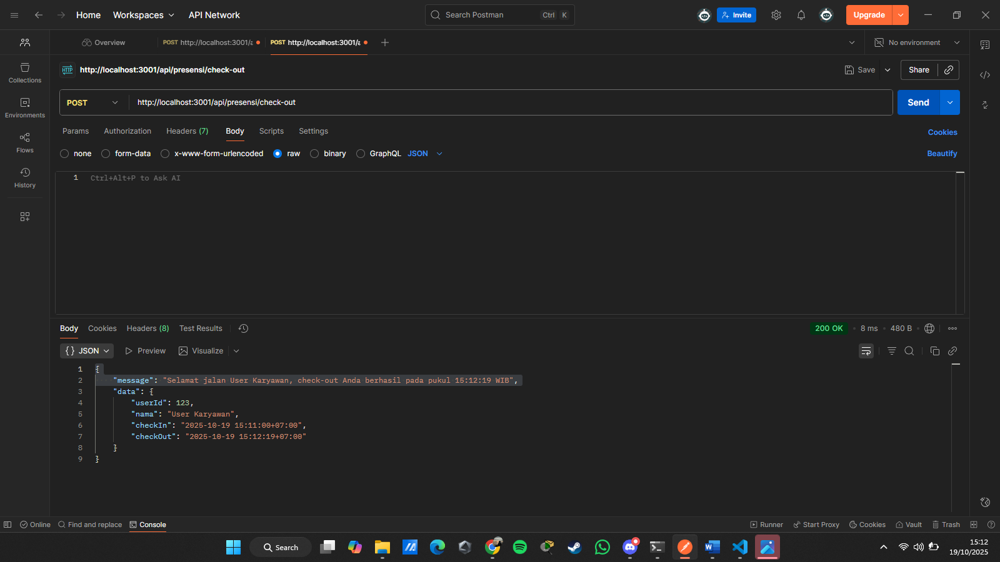
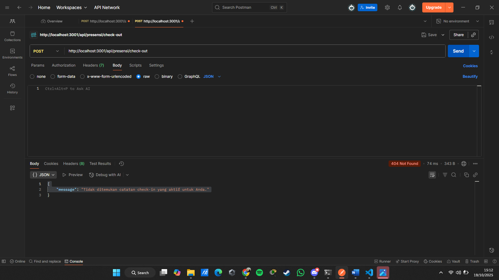
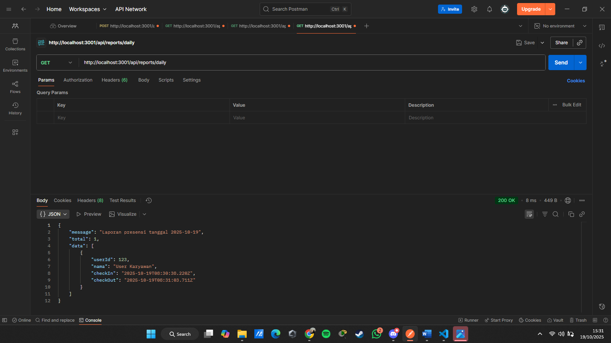
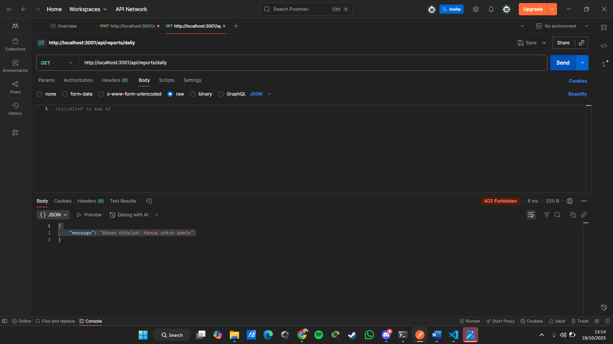

# Tugas 3

## 1️⃣ POST /api/presensi/check-in
- Berhasil check-in

- check-in lebih dari 1 kali

## 2️⃣ POST /api/presensi/check-out
- Berhasil check-out

- check-out lebih dari 1 kali

## 3️⃣ GET /api/reports/daily
- Admin

- Bukan admin
